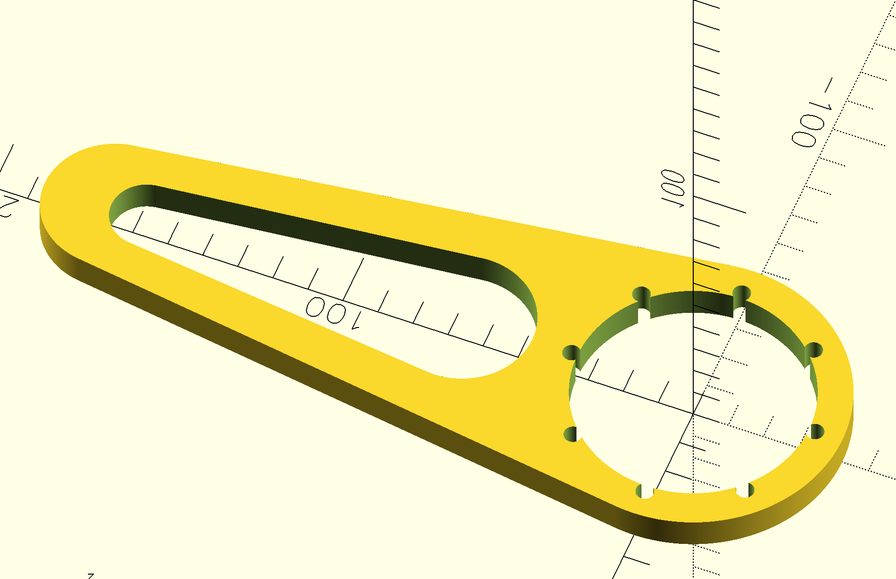
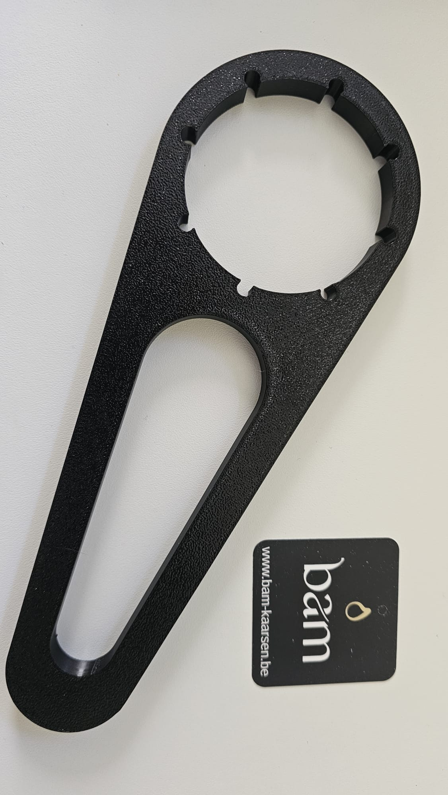

# DIN 61 cap wrench

A 3D-printed wrench for opening and closing DIN 61 caps — the large screw caps found on large 20l to 30l jugs. The inner ring fits snugly over the 66 mm cap, and eight small radial pegs engage the ribs around the cap edge to provide torque. A hollowed-out teardrop handle keeps weight and material use low while giving a comfortable grip.

Find it [here](https://www.thingiverse.com/thing:7354099) on thingiverse, or [here on makerworld](https://makerworld.com/en/models/2810311-din61-cap-wrench#profileId-3127932).

## Parameters

| Parameter | Value |
|---|---|
| Outer diameter | 85 mm |
| Inner diameter (cap fit) | 66 mm |
| Height | 10 mm |
| Grip pegs | 8 × ⌀5 mm |

## Render



## Printed result



## Demo


## OpenSCAD source

```scad
// DIN 61 cap wrench

// resolution
$fn = 400;

// dimensions
OUTER_D = 85;
INNER_D = 66;
HEIGHT = 10;

NUMBER_OF_HOLES = 8;
HOLE_OFFSET = 3.5;


// main

difference(){
    difference(){
      // outer outline
      hull(){
        cylinder(HEIGHT, OUTER_D/2, OUTER_D/2);
        translate([OUTER_D + 80, 0, 0 ])
        cylinder(HEIGHT, 20, 20);
      };  
      
      // remove some material to speed up printing and reduce waste material
      translate([INNER_D, 0,0])
      hull(){
        cylinder(HEIGHT, 20, 20);
        translate([90, 0,0])
         cylinder(HEIGHT, 10,10);
      };
    };
  
  // main hole to grab the cap
  cylinder(HEIGHT, INNER_D/2, INNER_D/2);
  // the small holes, to grab on to the cap ribs
  for (i = [0:NUMBER_OF_HOLES - 1]) {
      angle = i * 360 / NUMBER_OF_HOLES;
      x = ((INNER_D + HOLE_OFFSET) / 2) * cos(angle);
      y = ((INNER_D + HOLE_OFFSET) / 2) * sin(angle);
      translate([x, y, 0])
          cylinder(d = 5, h = HEIGHT);
  }  
};
```
